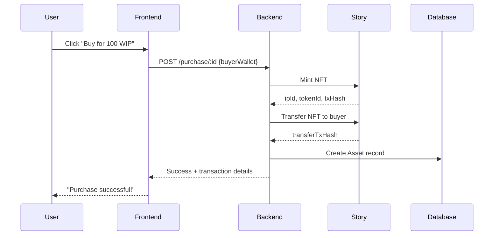
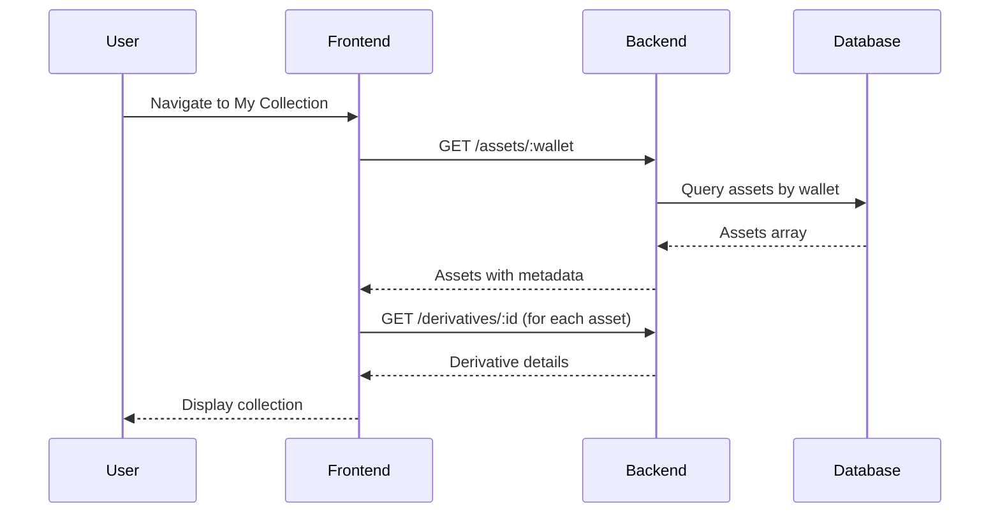

# ClearSky API Endpoints Documentation

## Base URL
```
Development: http://localhost:3000/api/v1
Production: TBD
```

---

## Table of Contents
1. [Authentication](#authentication)
2. [Marketplace](#marketplace)
3. [User Assets & Profile](#user-assets--profile)
4. [Devices](#devices)
5. [Download & Access](#download--access)

---

## Authentication

### POST /auth/login
**Description**: Login/register with wallet address

**Request**:
```typescript
{
  "walletAddress": "0x1234567890123456789012345678901234567890"
}
```

**Response**:
```typescript
{
  "success": true,
  "tokens": {
    "access_token": "eyJhbGc...",
    "refresh_token": "eyJhbGc...",
    "expiresIn": 3600
  },
  "user": {
    "walletAddress": "0x1234...",
    "createdAt": "2025-01-01T00:00:00Z"
  }
}
```

**Frontend Usage**:
- Called automatically after Coinbase Smart Wallet connection
- Used in `useAuth.ts` → `completeDeviceRegistration()`

---

## Marketplace

### GET /marketplace/derivatives
**Description**: List all available derivatives with filtering

**Query Parameters**:
| Parameter | Type | Required | Description |
|-----------|------|----------|-------------|
| `type` | string | No | Filter by type: "DAILY" or "MONTHLY" |
| `is_minted` | boolean | No | Filter minted/unminted derivatives |
| `limit` | number | No | Pagination limit (default: 50) |
| `offset` | number | No | Pagination offset (default: 0) |
| `search` | string | No | Search query (future use) |

**Request Example**:
```bash
GET /marketplace/derivatives?type=MONTHLY&is_minted=false&limit=10&offset=0
```

**Response**:
```typescript
{
  "success": true,
  "data": [
    {
      "derivative_id": "deriv_uuid_123",
      "type": "MONTHLY",
      "parent_data_ids": ["reading_1", "reading_2"],
      "content": "Full AI-generated report text...",
      "processing": {
        "content_hash": "QmXXX...",
        "ipfs_uri": "ipfs://QmXXX...",
        "ipfs_hash": "QmXXX...",
        "picked_at": "2025-01-01T00:00:00Z",
        "processed_at": "2025-01-01T00:05:00Z"
      },
      "ip_id": null,  // Null until minted
      "token_id": null,  // Null until minted
      "is_minted": false,
      "created_at": "2025-01-01T00:00:00Z",
      "primitive_data": [
        {
          "reading_id": "reading_1",
          "owner_id": "0x...",
          "aqi": 150,
          "timestamp": "2025-01-01T12:00:00Z",
          "meta": {
            "location": {
              "city": "Mumbai",
              "station": "Bandra"
            }
          },
          "sensor_data": {
            "PM2.5": [35, 40, 38],
            "PM10": [60, 65, 58],
            "CO2": [400, 410, 405]
          }
        }
      ]
    }
  ],
  "pagination": {
    "limit": 10,
    "offset": 0,
    "total": 25
  }
}
```

**Frontend Usage**:
- `marketplace.service.ts` → `browseMarketplace()`
- `RefinedReportsGrid.tsx` → Displays results

**Notes**:
- Backend does NOT support filtering by sensor type or city yet
- Frontend implements client-side filtering for these parameters

---

### GET /marketplace/derivatives/:derivativeId
**Description**: Get detailed information about a specific derivative

**Request Example**:
```bash
GET /marketplace/derivatives/deriv_uuid_123
```

**Response**:
```typescript
{
  "success": true,
  "data": {
    "derivative_id": "deriv_uuid_123",
    "type": "MONTHLY",
    "content": "Full AI report...",
    "processing": { /* ... */ },
    "ip_id": "0x...",
    "token_id": "123",
    "is_minted": false,
    "primitive_data": [ /* ... */ ]
  }
}
```

**Frontend Usage**:
- `user-assets.service.ts` → `getDerivativeDetails()`
- Used to enrich asset display with title/description

---

### POST /marketplace/purchase/:derivativeId
**Description**: Purchase and mint a derivative NFT

**Flow**:
1. Backend mints NFT on Story Protocol
2. Backend transfers NFT to buyer
3. Backend creates asset record
4. Returns transaction hashes

**Request Body**:
```typescript
{
  "buyerWallet": "0x1234567890123456789012345678901234567890"
}
```

**Response**:
```typescript
{
  "success": true,
  "message": "Purchase successful! NFT minted and transferred.",
  "data": {
    "asset_id": "asset_uuid_456",
    "ip_id": "0xabcdef...",
    "token_id": "789",
    "mint_tx_hash": "0x123abc...",
    "transfer_tx_hash": "0x456def...",
    "pricing": {
      "total_paid": 100,
      "platform_fee": 10,
      "original_owner_royalty": 5,
      "original_owner_wallet": "0x..."
    },
    "explorer_links": {
      "mint_tx": "https://explorer.story.foundation/tx/0x123abc...",
      "transfer_tx": "https://explorer.story.foundation/tx/0x456def..."
    }
  }
}
```

**Frontend Usage**:
- `RefinedReportCard.tsx` → `handleBuyLicense()`
- Direct fetch call (not in service layer yet)

**Important**:
- Backend handles EVERYTHING (minting + transfer)
- Frontend does NOT need to call Story SDK for NFT minting
- Frontend MAY call Story SDK for license minting (optional)

---

### POST /marketplace/purchase/bulk
**Description**: Bulk purchase multiple derivatives

**Request Body**:
```typescript
{
  "buyerWallet": "0x...",
  "derivativeIds": ["deriv_1", "deriv_2", "deriv_3"]
}
// OR
{
  "buyerWallet": "0x...",
  "filter": {
    "type": "MONTHLY",
    "limit": 5
  }
}
```

**Response**:
```typescript
{
  "success": true,
  "message": "Bulk purchase completed.",
  "data": {
    "total": 3,
    "successful": 2,
    "failed": 1,
    "results": [
      {
        "success": true,
        "derivative_id": "deriv_1",
        "asset_id": "asset_1",
        "token_id": "101",
        "ip_id": "0x..."
      },
      {
        "success": false,
        "derivative_id": "deriv_3",
        "error": "Derivative already minted"
      }
    ]
  }
}
```

**Frontend Usage**:
- Not yet implemented in frontend
- Can be added for bulk purchases feature

---

## User Assets & Profile

### GET /marketplace/assets/:walletAddress
**Description**: Get all assets owned by a wallet address

**Request Example**:
```bash
GET /marketplace/assets/0x1234567890123456789012345678901234567890
```

**Response**:
```typescript
{
  "success": true,
  "data": [
    {
      "asset_id": "asset_uuid_456",
      "owner_wallet": "0x1234...",
      "derivative_id": "deriv_uuid_123",
      "primitive_data_ids": ["reading_1", "reading_2"],
      "ip_id": "0xabcdef...",
      "token_id": "789",
      "purchase_price": 100,
      "purchase_tx_hash": "0x456def...",
      "royalty_paid_to_original_owner": 5,
      "platform_fee": 10,
      "purchased_at": "2025-01-10T08:30:00Z",
      "metadata": {
        "derivative_type": "MONTHLY",
        "content_hash": "QmXXX...",
        "ipfs_uri": "ipfs://QmXXX..."
      }
    }
  ]
}
```

**Frontend Usage**:
- `user-assets.service.ts` → `getUserAssets()`
- `MyCollectionTab.tsx` → Displays user's purchased assets

**Notes**:
- No authentication required (public endpoint)
- Returns empty array if wallet has no assets

---

## Devices

### GET /devices
**Description**: Get all devices registered to authenticated user

**Headers**:
```
Authorization: Bearer <access_token>
```

**Response**:
```typescript
{
  "success": true,
  "count": 2,
  "limit_reached": false,
  "devices": [
    {
      "device_id": "device_uuid_789",
      "owner_id": "0x1234...",
      "device_name": "Mumbai Air Monitor 1",
      "device_type": "AQI_SENSOR",
      "status": "ACTIVE",
      "location": {
        "city": "Mumbai",
        "station": "Bandra",
        "coordinates": {
          "latitude": 19.0596,
          "longitude": 72.8295
        }
      },
      "registered_at": "2024-12-01T00:00:00Z"
    }
  ]
}
```

**Frontend Usage**:
- `device.service.ts` → `getUserDevices()`
- `useAuth.ts` → `fetchUserDevicesAndDetermineMode()`

---

### POST /devices/register
**Description**: Register a new device

**Headers**:
```
Authorization: Bearer <access_token>
```

**Request Body**:
```typescript
{
  "device_name": "Mumbai Air Monitor 1",
  "device_type": "AQI_SENSOR",
  "location": {
    "city": "Mumbai",
    "station": "Bandra",
    "coordinates": {
      "latitude": 19.0596,
      "longitude": 72.8295
    }
  }
}
```

**Response**:
```typescript
{
  "success": true,
  "message": "Device registered successfully",
  "device": {
    "device_id": "device_uuid_789",
    "owner_id": "0x1234...",
    "device_name": "Mumbai Air Monitor 1",
    "status": "ACTIVE"
  }
}
```

**Frontend Usage**:
- Device registration flow
- Landing page device setup

---

## Download & Access

### GET /marketplace/download/:derivativeId
**Description**: Download derivative content after verifying NFT ownership

**Headers**:
```
Authorization: Bearer <access_token>
```

**Request Example**:
```bash
GET /marketplace/download/deriv_uuid_123
Authorization: Bearer eyJhbGc...
```

**Response (Success)**:
```typescript
{
  "success": true,
  "message": "Ownership verified. Download access granted.",
  "data": {
    "content": "Full AI-generated report text...",
    "processing": {
      "content_hash": "QmXXX...",
      "ipfs_uri": "ipfs://QmXXX...",
      "ipfs_hash": "QmXXX..."
    }
  }
}
```

**Response (Error - Not Owner)**:
```typescript
{
  "success": false,
  "message": "You do not own the NFT for this derivative."
}
```

**Frontend Usage**:
- `user-assets.service.ts` → `downloadDerivative()`
- `MyCollectionTab.tsx` → Download button

**Security**:
- Backend verifies NFT ownership via Story Protocol
- Checks if user's wallet owns the token_id
- Returns 403 if user doesn't own the NFT

---

## Missing Endpoints (To Be Implemented)

### 1. User Creations
```
GET /marketplace/derivatives?creator=0x...
```
**Purpose**: Get derivatives created by a specific user
**Status**: Not implemented yet

### 2. Community Derivatives
```
GET /marketplace/derivatives?type=creative_derivative
```
**Purpose**: Filter for community-created derivative works
**Status**: Needs derivative type classification

### 3. Royalty Status
```
GET /royalty/status/:ipId
```
**Purpose**: Get royalty earnings and claimable revenue
**Status**: Not implemented yet

### 4. Token Balance
```
GET /user/token-balance
```
**Purpose**: Get WIP and IP token balances
**Status**: Currently mocked in frontend

---

## Error Responses

All endpoints follow this error format:

```typescript
{
  "success": false,
  "message": "Error description",
  "error": {
    "code": "ERROR_CODE",
    "details": "Additional error details"
  }
}
```

**Common Status Codes**:
- `200` - Success
- `400` - Bad Request (invalid parameters)
- `401` - Unauthorized (missing/invalid token)
- `403` - Forbidden (no permission)
- `404` - Not Found
- `500` - Internal Server Error

---

## Rate Limiting
- No rate limiting currently implemented
- TODO: Add rate limiting for production

---

## Authentication Flow

1. User connects Coinbase Smart Wallet (via CDP)
2. Frontend calls `POST /auth/login` with wallet address
3. Backend returns JWT tokens
4. Frontend stores tokens in localStorage
5. All subsequent requests include `Authorization: Bearer <token>`
6. Tokens expire after 1 hour
7. Refresh token can be used to get new access token

---

## Data Flow Examples

### Purchasing a Derivative



### Viewing My Collection



---

## Frontend Service Mapping

| Frontend Service | Backend Endpoint |
|-----------------|------------------|
| `browseMarketplace()` | `GET /marketplace/derivatives` |
| `getDerivativeDetails()` | `GET /marketplace/derivatives/:id` |
| `purchaseDerivativeNFT()` | `POST /marketplace/purchase/:id` |
| `getUserAssets()` | `GET /marketplace/assets/:wallet` |
| `downloadDerivative()` | `GET /marketplace/download/:id` |
| `loginWithWallet()` | `POST /auth/login` |
| `getUserDevices()` | `GET /devices` |

---

## Environment Variables

```env
VITE_API_BASE_URL=http://localhost:3000
VITE_CDP_PROJECT_ID=your_coinbase_project_id
VITE_CDP_API_BASE_PATH=https://api.coinbase.com
```

---

## Testing

### Recommended Test Flow

1. **Setup**:
   - Connect Coinbase Smart Wallet
   - Ensure backend is running on port 3000

2. **Browse Marketplace**:
   ```bash
   curl http://localhost:3000/api/v1/marketplace/derivatives?type=MONTHLY&is_minted=false
   ```

3. **Purchase Derivative**:
   ```bash
   curl -X POST http://localhost:3000/api/v1/marketplace/purchase/deriv_123 \
     -H "Content-Type: application/json" \
     -d '{"buyerWallet": "0x..."}'
   ```

4. **View Assets**:
   ```bash
   curl http://localhost:3000/api/v1/marketplace/assets/0x...
   ```

5. **Download Content**:
   ```bash
   curl http://localhost:3000/api/v1/marketplace/download/deriv_123 \
     -H "Authorization: Bearer <token>"
   ```

---

## End of Documentation
