<div align="center">

# 🌤️ Clear Sky

### *The Trust Layer for Climate Data*

[](https://nextjs.org/)
[](https://www.typescriptlang.org/)
[](https://tailwindcss.com/)
[](https://storyprotocol.xyz/)
[](https://soliditylang.org/)
[](https://ipfs.io/)
[](https://www.coinbase.com/wallet)

**Clear Sky** is a revolutionary DePIN (Decentralized Physical Infrastructure Network) application that transforms environmental sensor data into **Verifiable Intellectual Property**. By creating a cryptographic trust layer for AQI, CO2, and temperature readings, we're solving the critical problem of fake data in environmental monitoring networks while enabling sensor owners to monetize their data streams securely.

[📖 Documentation](#-getting-started) • [🚀 Quick Start](#-installation) • [🏗️ Architecture](#-architecture) • [🤝 Contribute](#-contributing)

</div>

---

## 🎯 The Problem We Solve

Environmental monitoring networks face a critical challenge: **data integrity**. Traditional systems have no way to verify:
- ✗ That sensor data actually came from a legitimate device
- ✗ That readings haven't been tampered with in transit
- ✗ That operators aren't creating multiple fake sensors (Sybil attacks)
- ✗ Who owns the rights to monetize specific data streams

**Clear Sky** solves these problems by combining cryptographic signatures, decentralized identity via wallet authentication, and blockchain-based IP registration.

---

## ✨ Key Features

<table>
<tr>
<td width="50%">

### 🔐 Cryptographic Data Integrity
**ECDSA signing & Merkle trees** ensure every sensor reading is verifiable. Data is canonicalized, hashed, and signed at the source—creating an immutable audit trail from sensor to blockchain.

</td>
<td width="50%">

### 💰 Monetizable Data Assets
**Story Protocol IP registration** transforms raw sensor data into on-chain intellectual property. Batch mint thousands of readings as NFT-backed IP Assets with customizable licensing terms.

</td>
</tr>
<tr>
<td>

### 🔑 Smart Wallet Integration
**Coinbase Smart Wallet & Passkeys** eliminate seed phrase friction. Gas sponsorship and social recovery make Web3 accessible to anyone—no crypto expertise required.

</td>
<td>

### 🤖 AI-Powered Derivatives
**Automated insight generation** uses AI to summarize environmental trends, then mints derivative IP Assets linked to parent data as "Child IPs"—creating verifiable AI-generated insights.

</td>
</tr>
<tr>
<td colspan="2">

### 🛒 Secure Data Marketplace
**Token-gated S3 downloads** ensure only License Token holders can access data. Buyers mint licenses on-chain, receive secure pre-signed download URLs, and decrypt data—all without centralized gatekeepers.

</td>
</tr>
<tr>
<td colspan="2">

### 🔐 Wallet-Based Authentication
**Coinbase Smart Wallet address authentication** ensures unique operator identity. Each wallet address serves as a cryptographic identity, preventing unauthorized access while maintaining user sovereignty.

</td>
</tr>
</table>

---

## 🔄 How It Works

Clear Sky operates through a series of integrated flows that ensure data integrity, provenance, and monetization:

### 1️⃣ **Ingestion Pipeline**
Sensors sign readings with ECDSA keys → Backend canonicalizes JSON → Creates Merkle Leaves → Stores signed data with cryptographic proofs

### 2️⃣ **Identity & Onboarding**
Operators create Coinbase Smart Wallet with passkey → Authenticate via wallet address → Register sensor devices → Link crypto identity to physical infrastructure

### 3️⃣ **IP Registration**
Batched sensor data → Metadata uploaded to IPFS → Smart contract mints IP Asset on Story Protocol → Returns on-chain asset ID

### 4️⃣ **Marketplace & Licensing**
Buyers discover data streams → Mint License Tokens via smart contract → Backend verifies ownership → Issues secure S3 pre-signed URL → Buyer downloads encrypted data

### 5️⃣ **AI Derivatives**
Automated pipeline analyzes parent data → Generates insights/summaries → Mints Child IP Assets → Links to parent on-chain → Creates verifiable AI provenance

---

## 🏗️ Architecture

### 📊 High-Level System Architecture


### 🔄 Ingestion Flow: From Sensor to Blockchain

```mermaid
sequenceDiagram
    participant S as 🌡️ Sensor Device
    participant B as 🔧 Backend API
    participant DB as 📊 Database
    participant IPFS as 📦 IPFS
    participant SC as 📜 Story Protocol

    S->>S: 1. Read Environmental Data<br/>(Temp, AQI, CO2)
    S->>S: 2. Sign JSON with ECDSA Key
    S->>B: 3. POST /api/sensor/reading<br/>{data, signature, pubKey}

    B->>B: 4. Verify Signature<br/>(ecrecover)
    B->>B: 5. Canonicalize JSON<br/>(Deterministic Order)
    B->>B: 6. Compute Merkle Leaf<br/>Hash = keccak256(data)

    B->>DB: 7. Store Reading + Proof<br/>{reading, signature, hash}

    Note over B,DB: ⏰ Batch window (e.g., 1000 readings)

    B->>B: 8. Construct Merkle Tree<br/>from Batch Leaves
    B->>IPFS: 9. Upload Metadata JSON<br/>{root, readings, timestamps}
    IPFS-->>B: 10. Return CID (bafyXXX...)

    B->>SC: 11. mintIPAsset(cid, merkleRoot)
    SC-->>B: 12. Return IP Asset ID (#12345)

    B->>DB: 13. Update Records<br/>{ipAssetId, cid, status: minted}
    B-->>S: 14. Response: Success

    Note over S,SC: ✅ Data now verifiable on-chain
```



### 🛒 Buyer Journey: Discovery to Download

```mermaid
sequenceDiagram
    participant U as 👤 Data Buyer
    participant UI as ⚛️ Frontend
    participant W as 💳 Smart Wallet
    participant SC as 📜 Story Protocol
    participant API as 🔧 Backend
    participant S3 as ☁️ AWS S3

    U->>UI: 1. Browse Marketplace<br/>(Filter by city, date, AQI)
    UI->>API: 2. GET /api/marketplace/datasets
    API-->>UI: 3. Return Available Datasets<br/>{ipAssetId, price, metadata}

    UI->>U: 4. Display Data Previews
    U->>UI: 5. Click "Purchase License"

    UI->>W: 6. Request Transaction<br/>mintLicense(ipAssetId)
    W->>W: 7. Gas Sponsorship<br/>(Paymaster covers fees)
    W->>SC: 8. Execute mintLicense()
    SC-->>W: 9. Return License Token ID (#789)

    W-->>UI: 10. Transaction Success
    UI->>API: 11. POST /api/download/request<br/>{ipAssetId, licenseTokenId}

    API->>SC: 12. Verify License Ownership<br/>ownerOf(tokenId) == buyer
    SC-->>API: 13. Confirmation: Valid Owner

    API->>S3: 14. Generate Pre-signed URL<br/>(Expires in 1 hour)
    S3-->>API: 15. Return Secure URL

    API-->>UI: 16. {downloadUrl, expires}
    UI->>S3: 17. Download Encrypted Data
    S3-->>UI: 18. Stream ZIP File

    UI->>UI: 19. Decrypt Data Locally<br/>(Using License Key Derivation)
    UI-->>U: 20. Data Available! 🎉

    Note over U,S3: 🔒 Only valid license holders can download
```



---

## 🛠️ Tech Stack

### **Frontend**
- **Framework:** Next.js 14 (App Router) with React 19
- **Styling:** Tailwind CSS + shadcn/ui components
- **State Management:** Zustand + TanStack Query
- **Web3:** Wagmi + Viem, Coinbase Smart Wallet SDK
- **Authentication:** Coinbase Smart Wallet (Passkey-based)

### **Backend**
- **Runtime:** Node.js 22+ with Express
- **Database:** PostgreSQL (Prisma ORM)
- **Storage:** IPFS (Pinata/Web3.Storage), AWS S3
- **Cryptography:** ethers.js, @noble/secp256k1, merkletreejs

### **Blockchain**
- **Smart Contracts:** Solidity 0.8.20 (Foundry)
- **IP Protocol:** Story Protocol (IP Asset & Licensing modules)
- **Networks:** Base Sepolia (testnet), Base (mainnet)
- **Wallet:** Coinbase Smart Wallet (CDP)

### **AI/ML**
- **Models:** OpenAI GPT-4, Anthropic Claude
- **Pipeline:** Python 3.11 (FastAPI), Celery (task queue)
- **Vector DB:** Pinecone (for semantic search)

---

## 🚀 Getting Started

### 📋 Prerequisites

- **Node.js** 22+ and npm
- **PostgreSQL** 14+ (or Docker)
- **Git** for version control
- Accounts:
  - [Coinbase Developer Portal](https://portal.cdp.coinbase.com) (CDP Project ID)
  - [Story Protocol](https://storyprotocol.xyz/) (testnet access)
  - [Pinata](https://pinata.cloud/) or [Web3.Storage](https://web3.storage/) (IPFS)

---

### 📥 Installation

```bash
# Clone the repository
git clone https://github.com/your-org/clear-sky.git
cd clear-sky/Client

# Install dependencies
npm install --legacy-peer-deps

# Note: --legacy-peer-deps is required for React 19 compatibility
```

---

### ⚙️ Environment Variables

Copy the example environment file and configure your credentials:

```bash
cp .env.example .env
```

Edit `.env` with your values:

```env
# ===== COINBASE DEVELOPER PLATFORM =====
VITE_CDP_PROJECT_ID=your-cdp-project-id
VITE_CDP_API_BASE_PATH=https://api.cdp.coinbase.com

# ===== BACKEND API =====
VITE_API_BASE_URL=http://localhost:3000

# ===== STORY PROTOCOL =====
VITE_STORY_IP_ASSET_REGISTRY=0x1234...abcd  # Sepolia address
VITE_STORY_LICENSING_MODULE=0x5678...ef01   # Sepolia address

# ===== IPFS =====
VITE_IPFS_GATEWAY=https://gateway.pinata.cloud/ipfs

# ===== BRANDING =====
VITE_APP_LOGO_URL=https://your-cdn.com/logo.png
VITE_APP_NAME=Clear Sky
```

**📍 Getting Your CDP Project ID:**
1. Sign in to [CDP Portal](https://portal.cdp.coinbase.com)
2. Create or select a project
3. Go to Settings (⚙️) → Copy **Project ID**
4. Add allowed domain: `http://localhost:5173` (dev) or your production domain

---

### 🏃 Running the Application

#### Development Mode

```bash
npm run dev
```

The app will be available at **http://localhost:5173**

#### Build for Production

```bash
npm run build
npm run preview  # Preview production build locally
```

#### Type Checking

```bash
npm run type-check
```

---

## 📂 Project Structure

```
Client/
├── src/
│   ├── app/                      # App configuration
│   │   ├── providers/            # Context providers (Wagmi, CDP, Zustand)
│   │   ├── router/               # React Router setup
│   │   └── store/                # Global state management
│   │
│   ├── pages/                    # Route components
│   │   ├── Landing/              # Authentication & onboarding
│   │   ├── Dashboard/            # Sensor operator dashboard
│   │   ├── Marketplace/          # Data discovery & purchase
│   │   └── Analytics/            # Data visualization
│   │
│   ├── components/               # Reusable UI components
│   │   ├── ui/                   # shadcn/ui primitives
│   │   ├── layout/               # Layout wrappers
│   │   ├── sensor/               # Sensor registration & management
│   │   └── marketplace/          # Marketplace cards & filters
│   │
│   ├── services/                 # External integrations
│   │   ├── api/                  # Backend API clients
│   │   ├── ipfs/                 # IPFS upload/fetch utilities
│   │   └── story/                # Story Protocol contract ABIs
│   │
│   ├── hooks/                    # Custom React hooks
│   │   ├── useAuth.ts            # Authentication & wallet
│   │   ├── useSensorData.ts      # Sensor CRUD operations
│   │   └── useIPAsset.ts         # Story Protocol interactions
│   │
│   ├── lib/                      # Utility libraries
│   │   ├── crypto.ts             # ECDSA, hashing, Merkle trees
│   │   ├── device.ts             # Device fingerprinting
│   │   └── formatting.ts         # Date, number, address formatting
│   │
│   ├── config/                   # Configuration
│   │   ├── env.ts                # Environment variable validation
│   │   ├── routes.ts             # Route constants
│   │   └── contracts.ts          # Contract addresses & ABIs
│   │
│   └── types/                    # TypeScript definitions
│       ├── sensor.types.ts
│       ├── ipAsset.types.ts
│       └── marketplace.types.ts
│
├── public/                       # Static assets
├── .env.example                  # Environment template
├── package.json
└── README.md                     # You are here!
```

---

## 🔗 Smart Contracts

Clear Sky leverages **Story Protocol's modular IP framework** for on-chain IP management:

### 📜 Core Contracts

| Contract | Address (Base Sepolia) | Purpose |
|----------|------------------------|---------|
| **IPAssetRegistry** | `0x1234...abcd` | Mints & manages IP Assets (ERC-721) |
| **LicensingModule** | `0x5678...ef01` | Handles license minting & verification |
| **RoyaltyModule** | `0x9abc...def0` | Distributes revenue to IP owners |

### 🔧 Key Functions

```solidity
// Mint an IP Asset for sensor data batch
function mintIPAsset(
    string memory ipfsHash,
    bytes32 merkleRoot,
    uint256 dataCount
) external returns (uint256 ipAssetId);

// Mint a license token for data access
function mintLicense(
    uint256 ipAssetId,
    address buyer,
    uint256 price
) external returns (uint256 licenseTokenId);

// Register derivative AI-generated IP
function registerDerivative(
    uint256 parentIpAssetId,
    string memory derivativeIpfsHash
) external returns (uint256 childIpAssetId);
```

**📄 Full contract source:** `contracts/src/ClearSkyIPManager.sol`

---

## 🗺️ Roadmap

### ✅ Phase 1: Foundation (Completed)
- [x] ECDSA signing & Merkle tree verification
- [x] Coinbase Smart Wallet integration
- [x] Wallet address-based authentication
- [x] Story Protocol IP minting
- [x] Automated AI summarization pipeline
- [x] Child IP minting for derivatives

### 🚧 Phase 2: Marketplace (In Progress)
- [x] Data discovery & filtering UI
- [x] License token minting flow
- [ ] Secure S3 download handshake
- [ ] Decryption key distribution

### 🔮 Phase 3: Advanced Analytics (Q1 2026)
- [ ] Real-time AQI prediction models
- [ ] Interactive data visualization dashboards
- [ ] Anomaly detection & alerting system
- [ ] Historical trend analysis tools

### 🌟 Phase 4: Expansion (Q2 2026)
- [ ] Multi-sensor support (weather, noise, radiation)
- [ ] Mobile app for on-the-go monitoring
- [ ] DAO governance for network parameters
- [ ] Cross-chain bridge (Ethereum, Polygon, Arbitrum)

---

## 🤝 Contributing

We welcome contributions from the community! Here's how you can help:

### 🐛 Reporting Bugs

Open an issue on [GitHub Issues](https://github.com/your-org/clear-sky/issues) with:
- Clear description of the bug
- Steps to reproduce
- Expected vs. actual behavior
- Screenshots (if applicable)

### 💡 Feature Requests

Have an idea? Create a feature request issue with:
- Problem statement
- Proposed solution
- Alternative approaches
- Impact on users

### 🔧 Pull Requests

1. Fork the repository
2. Create a feature branch: `git checkout -b feature/amazing-feature`
3. Commit your changes: `git commit -m 'feat: add amazing feature'`
4. Push to the branch: `git push origin feature/amazing-feature`
5. Open a Pull Request

**📖 Read our [Contributing Guide](./CONTRIBUTING.md) for code standards and commit conventions.**

---

## 📄 License

This project is licensed under the **MIT License** - see the [LICENSE](./LICENSE) file for details.

---

## 🙏 Acknowledgments

- **[Story Protocol](https://storyprotocol.xyz/)** for pioneering on-chain IP infrastructure
- **[Coinbase](https://www.coinbase.com/)** for making Web3 accessible with Smart Wallets
- **[IPFS](https://ipfs.io/)** for decentralized storage
- The **DePIN community** for inspiring real-world blockchain applications

---

## 📞 Support & Community

- **📖 Documentation:** [docs.clearsky.network](https://docs.clearsky.network) (coming soon)
- **💬 Discord:** [discord.gg/clearsky](https://discord.gg/clearsky)
- **🐦 Twitter:** [@ClearSkyDePIN](https://twitter.com/ClearSkyDePIN)
- **📧 Email:** support@clearsky.network

---

<div align="center">

**Built with 💚 for a cleaner, more transparent planet**

*Turning environmental data into verifiable truth, one reading at a time*

🌤️ **Clear Sky** • Making Climate Data Trustworthy

</div>
